# Proyecto integrador M4
## Documento técnico del **Sistema Médico de Asistencia Inteligente (SMAI)**

*Documentación elaborado por [Hadson Paredes](https://www.linkedin.com/in/hadson-paredes/) - 2026*
- Repositorio: [Project-Agentic-AI-SMAI](https://github.com/devhadson/Project-Agentic-AI-SMAI)
- Elaboración: Sistema Médico de Asistencia Inteligente (SMAI)
  - Plataforma inteligente diseñada para la gestión administrativa de pacientes con diabetes.
  - Arquitectura: Híbrida (Determinista y Agéntica)
  - Modelo Fundacional IA: OpenAI (`GPT-4o`)
  - Contexto, Prompting y Orquestación de Agentes: LangChain Framework
  - Frontend: Streamlit Framework 
  - Base de datos: Transaccional `PostgreSQL` y Vectorial `FAISS`
- Especialización: IA Engineer y Arquitetura de Sistemas Generativos 
- Docente: [Miguel Angel Cotrina Espinoza](https://www.linkedin.com/in/mcotrina/)
- [Instituto de Datos e Inteligencia Artificial - URP](https://www.linkedin.com/company/idia-urp/)

---

> [!Important]  
> Este proyecto es la continuidad del [Proyecto integrador M2](https://github.com/devhadson/Project-Agentic-AI-Virtual-Medical-Assistant), donde se detalla acerca del desarrollo del Agente Inteligente con Memoria y Arquitectura Justificada.

---

### 1. Objetivo General

El objetivo es automatizar la gestión administrativa de pacientes con diabetes, utilizando modelos de lenguaje (LLMs) para evaluar niveles de glucosa, agendar citas y consultar historiales clínicos de manera segura, eficiente y centrada en el paciente.

---

### 2. Alcance del Proyecto

El sistema gestiona el ciclo de vida del paciente endocrino (específicamente pacientes con diabetes) desde la lectura de glucosa hasta la asignación de citas, integrando persistencia relacional a las transacciones y almacenamiento vectorial para la consulta de historias clínicas (HC) mediante un modelo de sistema de **Generación Aumentada por Recuperación (RAG)**. 

Principales carácteristicas de Sistema Médico de Asistencia Inteligente (SMAI).

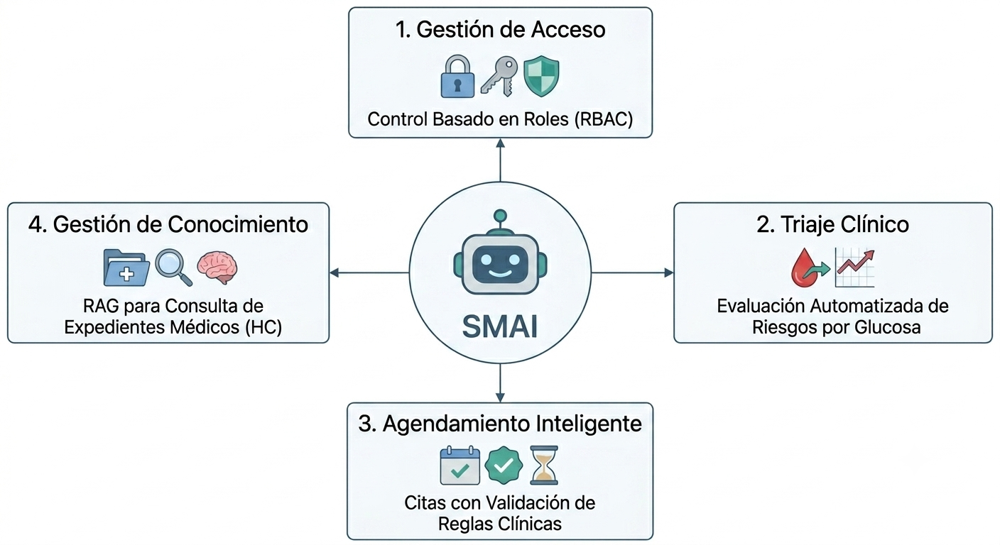

1. **Gestión de acceso:** Control basado en roles (RBAC).
2. **Triaje clínico:** Evaluación automatizada de riesgos según niveles de glucosa.
3. **Agendamiento:** Programación inteligente de citas con validación de reglas de negocio.
4. **Gestión de conocimiento:** Implementación de RAG para consulta de expedientes médicos (HC).

#### 2.1. Persistencia de Datos

* **PostgreSQL:** Almacena la estructura relacional (usuarios, dataset_paciente, citas, médicos) y metadatos (index_rag_pdf) del sistema RAG.
* **FAISS:** Proporciona persistencia vectorial local para la recuperación de información semántica (archivos cargados).

#### 2.2. Diagrama de Relación de Entidades (ERD)

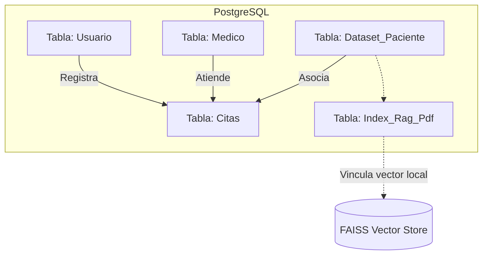

**Descripción de Tablas:**
1. `usuario`: Gestión de autenticación y roles.
2. `citas`: Registro central de triaje, urgencias y citas programadas.
3. `medico`: Directorio de profesionales y sus especialidades.
4. `dataset_paciente`: Datos crudos de salud (glucosa) para triaje.
5. `index_rag_pdf`: Mapeo de archivos físicos con ID clínico (`hc_id`) vs. su ID vectorial (`index_id`) en FAISS.

---

### 3. Problema / Dolor del Negocio

El sistema en primer instancia resuelve la **saturación operativa** mediante los datos previamente ingresados y el **tiempo de respuesta** en la atención a pacientes con condiciones crónicas (diabetes). Asimismo, elimina la carga administrativa manual y el riesgo humano en la categorización inicial de urgencias médicas. Además, la solución inteligente responde a las siguientes preguntas planteadas:

* **A: ¿Qué problema tiene la empresa o usuario?** Retrasos peligrosos en el triaje de glucosa y sobrecarga de servicios médicos.
* **B: Qué proceso manual, lento o repetitivo se busca mejorar** Clasificación manual y repetitiva propensa a errores humanos.
* **C ¿Qué impacto genera actualmente ese problema?:** Riesgos vitales, costos operativos elevados e ineficiencia en recursos.
* **D ¿Por qué una solución con IA Generativa puede aportar valor?:** La IA Generativa permite guiar al usuario, recopilar contexto clínico y ofrecer mitigación inmediata.
* **E ¿Qué resultado espera obtener el usuario?:** Atención automatizada, diagnósticos seguros y seguimiento personalizado.
* **F ¿Qué preguntas reales necesita responder el usuario final?:** Validación de restricciones dietéticas que tiene el paciente.
* **G ¿Qué documentos, manuales, políticas, productos, expedientes o archivos contienen ese conocimiento?:** Historias clínicas en PDF, protocolos endocrinos, resultados de laboratorio, expedientes de pacientes.
* **H ¿Qué proceso manual de búsqueda o consulta se busca reducir?:** Búsqueda manual de folios en archivos físicos o sistemas de documentos no indexados.
* **I ¿Qué impacto tiene responder con información incompleta, desactualizada o sin fuente?:** Malas decisiones clínicas, tratamientos contraindicados y pérdida de confianza.
* **J ¿Qué tipo de evidencia debe mostrar la solución para que el usuario confíe en la respuesta?:** La solución debe mostrar el **resultados según los fragmentos relevantes** (resultado de búsqueda en Historia Clinicas) al entregar la respuesta.

---

### 4. Base de Conocimiento

El sistema convierte un documento médico no estructurado en una estructura lógica preparada para la IA.

La base de conocimiento no es solo el archivo PDF, sino el **repositorio enriquecido** resultante del proceso de ingesta, donde la información se fragmenta estratégicamente para maximizar la relevancia en la recuperación (RAG).

#### 4.1. Gráfico de la Base de Conocimiento (Pipeline de Procesamiento)

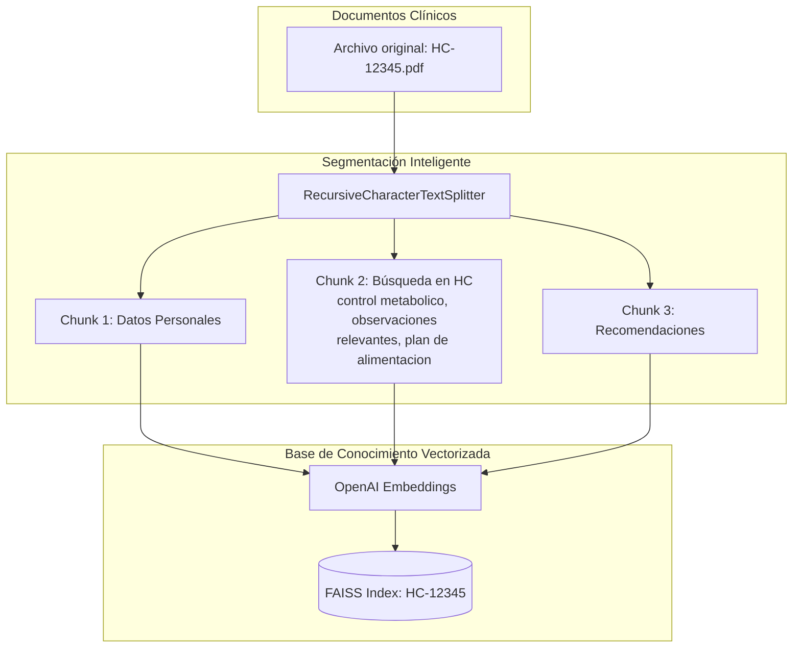

#### 4.2. Componentes de la Base de Conocimiento

La base de conocimiento se estructura bajo los siguientes pilares:

1. **Contexto Atómico (Chunks):** Al utilizar un `chunk_size` de 500 tokens con un `overlap` de 50, garantizamos que el modelo de lenguaje (`gpt-4o`) no pierda el hilo conductor entre fragmentos. Esto es vital para el seguimiento de condiciones crónicas como la diabetes, donde un valor de glucosa debe estar vinculado a la fecha y tratamiento específico.
2. **Identificación única (Metadata):** A diferencia de una base de conocimiento convencional, cada índice en `FAISS` está ligado a un `hc_id` en `PostgreSQL`. Esto permite que la "Base de Conocimiento" sea **dinámica y segura**, cargando únicamente el índice del paciente que se está consultando.
3. **Vectorización semántica:** Al usar `OpenAIEmbeddings`, la base de conocimiento no solo busca por palabras clave (ej. "control metabolico"), sino por intención clínica (ej. "observaciones", "valores elevados", "plan de alimentación"), permitiendo que el agente médico entienda el estado de salud aunque el término técnico varíe.

Esta arquitectura transforma archivos PDF estáticos en una **base de conocimiento inteligente** capaz de alimentar al LLM con la precisión necesaria para la toma de decisiones clínicas.

---

### 5. Pipeline RAG y Flujos de Datos

A continuación, presento la documentación técnica detallada solicitada para los flujos del sistema y la arquitectura de soluciones.

### 5.1. Pipeline de Ingesta (ETL) e Indexación

El pipeline de ingesta es un proceso automatizado diseñado para transformar documentos clínicos no estructurados en conocimiento recuperable. Este flujo garantiza que la información médica sea segmentada y vectorizada para su uso en consultas semánticas.

**Flujo del Proceso:**

1. **Carga (Extraction):** Se utiliza `PyPDFLoader` o `TextLoader` para extraer el contenido crudo desde archivos locales (historias clínicas).
2. **Segmentación (Transformation):** Mediante `RecursiveCharacterTextSplitter`, el texto se divide en fragmentos (*chunks*) de 500 tokens con una superposición de 50 tokens, optimizando el contexto para el modelo.
3. **Embeddings:** Se utiliza `OpenAIEmbeddings` para convertir cada fragmento de texto en vectores numéricos de alta dimensión.
4. **Vector Store (Loading):** Los vectores se indexan y guardan en el sistema `FAISS` local, creando un índice único para cada documento.
5. **Persistencia de Metadata:** Finalmente, el sistema registra el `index_id` y el `hc_id` (ID de historia clínica) en la base de datos `PostgreSQL` para permitir búsquedas filtradas eficientes.

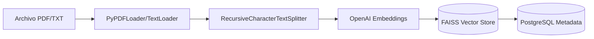

### 5.3. Pipeline de Ejecución e Inferencia

Este pipeline gestiona la interacción entre el usuario y la base de conocimiento médica mediante un agente de razonamiento. La ejecución sigue un patrón de **Ciclo de Reacción (ReAct)**:

1. **Entrada del Usuario:** A través de la interfaz **Streamlit**, el usuario ingresa una consulta natural (ej. "Analiza la última HC del paciente HC-12345").
2. **Orquestación con LangChain:** El agente recibe el mensaje y, mediante el LLM (GPT-4o), analiza la intención. Si detecta una solicitud de información clínica, activa automáticamente la función `herramienta_busqueda_rag` definida en `tools.py`.
3. **Consulta Híbrida (Tools Layer):**
4. **SQL (Validación):** El sistema consulta `PostgreSQL` para verificar que el `hc_id` exista y para recuperar el `index_id` (la ruta al índice vectorial).
5. **Vectorial (FAISS):** Una vez validado, carga el índice de `FAISS` local y realiza una búsqueda de similitud semántica.
6. **Síntesis y Generación:** Los fragmentos de texto recuperados se inyectan como *contexto* en el prompt del LLM (`gpt-4o`). El modelo utiliza este contexto enriquecido para redactar una respuesta coherente y precisa.
7. **Respuesta Final:** El sistema presenta al usuario la respuesta en la interfaz de usuario, manteniendo el historial del chat para consultas de seguimiento.

**Descripción de los Componentes en la Ejecución**

| Componente | Rol en la Inferencia | Script Asociado |
| --- | --- | --- |
| **Streamlit UI** | Punto de entrada y despliegue del resultado final. | `main.py` |
| **Agente LangChain** | Orquestador que decide qué herramienta invocar. | `main.py`, `tools.py` |
| **Herramientas (Tools)** | Interfaz segura hacia SQL y VectorStore (FAISS). | `tools.py` |
| **PostgreSQL** | Fuente de verdad para validar IDs de pacientes y citas. | `db_connector.py` |
| **FAISS** | Motor de búsqueda semántica sobre documentos PDF. | `rag_pipeline.py` |

**Diagrama de Secuencia de la Inferencia**

El siguiente diagrama detalla cómo interactúan los componentes en tiempo real durante una consulta del usuario:

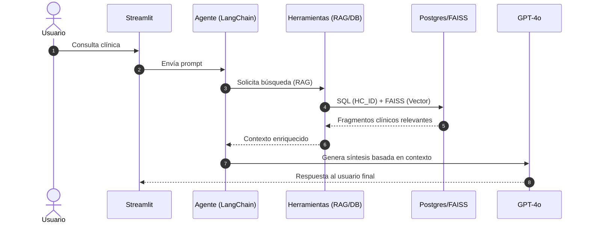

Este proceso garantiza que el SMAI no solo responda preguntas, sino que actúe con **precisión clínica**, validando cada consulta contra la base de datos relacional antes de recuperar información del almacén vectorial, lo que asegura un aislamiento total entre historiales de diferentes pacientes.

---

### 6. Arquitectura de Solución:

La solución se basa en una arquitectura **Modular por Capas**, lo que permite una escalabilidad independiente. La capa de desarrollo se divide en:

#### 6.1. Detalle de componentes por capas

**Capa de Presentación**
Esta capa actúa como el cliente ligero que interactúa con el usuario y dispara las funciones del agente.

* **Usuarios:** Incluye los roles de Administrador, Doctor, Enfermera y Paciente.
* **Streamlit (Frontend):** El componente de interfaz de usuario que consume el estado de la sesión.

**Capa de Orquestación y Lógica**
Esta capa gestiona el ciclo de vida del agente y la ejecución de herramientas.

* **LangChain Agent Orquestador:** El núcleo que gestiona la lógica, la memoria y la ejecución de herramientas.
* **OpenAI LLM (GPT-4o):** El modelo de lenguaje utilizado por el orquestador para el razonamiento.
* **Python-dotenv (Credenciales):** Gestiona la seguridad y credenciales necesarias para la lógica del agente.

**Capa de Persistencia**
Esta capa divide la carga para gestionar datos estructurados y no estructurados.

* **FAISS Vector Store (Índices):** Base de datos vectorial para la búsqueda de conocimiento no estructurado.
* **PostgreSQL (Metadata & Citas):** Base de datos relacional para la integridad de los datos clínicos y citas.

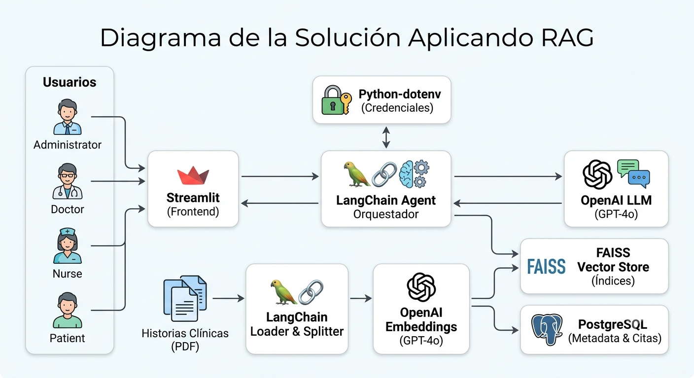

#### 6.2. Diagrama de Componentes

Componente de la arquitectura de capas que separa la presentación, la lógica de orquestación y el almacenamiento persistente. Esta separación permite que el sistema sea modular, facilitando el mantenimiento y la actualización de los modelos de IA sin afectar la base de datos relacional.

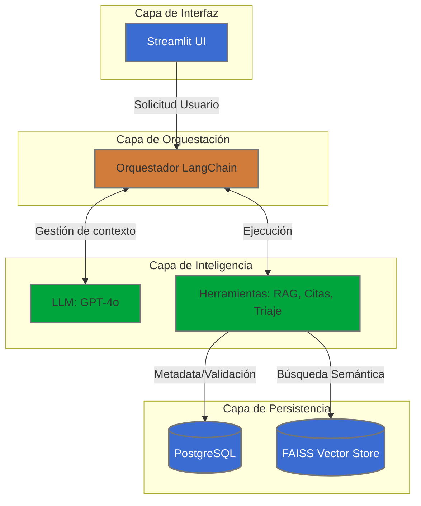

**Descripción de los Componentes:**

* **Streamlit UI:** Punto de entrada. Captura la entrada del usuario y despliega las respuestas del agente.
* **Orquestador LangChain:** Cerebro del sistema. Administra el historial de chat, invoca las herramientas (`Tools`) según la intención del usuario y gestiona el flujo de tokens.
* **LLM (GPT-4o):** Procesa el lenguaje natural, extrae entidades, clasifica la urgencia clínica y formula respuestas coherentes.
* **Tools (RAG, Citas, Triaje):** Interfaz lógica que conecta al agente con los datos internos.
* **PostgreSQL / FAISS:** El primero asegura la integridad transaccional (citas, IDs); el segundo permite búsquedas de similitud escalar sobre los documentos médicos.

#### 6.3. Stack tecnológico y funcionalidad

La siguiente tabla resume el stack tecnológico seleccionado y el detalla de la funcionalidad para garantizar el rendimiento y la seguridad de la solución inteligente:

| Capa | Tecnología / Herramienta | Funcionalidad |
| --- | --- | --- |
| **Frontend** | 🖥️ Streamlit | Interfaz web responsiva para el asistente médico. |
| **Backend** | 🐍 Python 3.10+ | Lenguaje base y lógica de negocio. |
| **Orquestación IA** | 🦜 LangChain | Framework para agentes y herramientas RAG. |
| **Base de Datos (SQL)** | 🐘 PostgreSQL (SQLAlchemy) | Almacenamiento de transacciones y metadata. |
| **Base de Datos (Vector)** | 🔍 FAISS | Búsqueda rápida de similitud semántica. |
| **Modelo de IA** | 🧠 OpenAI (GPT-4o) | Razonamiento clínico y generación de lenguaje. |
| **Seguridad** | 🔐 Python-dotenv | Gestión de variables de entorno y secretos. |

---

### 7. Documentación de Componentes RAG

#### 7.1. Lista de componentes RAG

Este conjunto de componentes asegura un sistema de búsqueda médica de alta precisión y contexto, donde cada respuesta es verificable y basada en fuentes bibliográficas verificadas.

| Componente Aplicado en RAG | Descripción y Función en la Solución |
| --- | --- |
| **Orquestador: LangChain Agent** | **Cerebro Central.** Coordina la lógica del flujo de trabajo, decide cuándo invocar herramientas y gestiona la conversación para proporcionar respuestas coherentes. |
| **Loader: PyPDFLoader** | **Extractor de Contenido.** Carga y extrae texto de archivos PDF de Historias Clínicas, permitiendo su procesamiento en el pipeline de ingesta. |
| **Splitter: RecursiveCharacterTextSplitter** | **Segmentador de Texto.** Divide los documentos largos en fragmentos más pequeños y manejables, manteniendo el contexto semántico para una mejor indexación. |
| **Embeddings: OpenAIEmbeddings** | **Modelador Vectorial.** Convierte los fragmentos de texto en vectores numéricos de alta dimensión, permitiendo la búsqueda por similitud semántica. |
| **Vector Store: FAISS** | **Almacenamiento de Índices Vectoriales.** Guarda y gestiona los vectores de los fragmentos de texto, facilitando búsquedas rápidas y eficientes por similitud. |
| **Retriever: similarity_search con filtro de index_id en Postgres** | **Recuperador de Información.** Busca los fragmentos más relevantes en FAISS, filtrando por el `index_id` obtenido de PostgreSQL para garantizar la precisión de la fuente. |
| **Memoria: `chat_history` en `st.session_state`** | **Gestor de Contexto.** Almacena el historial de chat en el estado de la sesión, permitiendo al agente mantener conversaciones con memoria y contexto. |

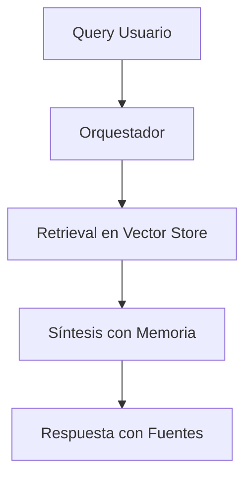

#### 7.2. Flujo del filtrado Híbrido

El sistema implementa un **RAG Híbrido** para resolver el desafío de la seguridad y el escalamiento de datos médicos. En lugar de buscar en un único índice vectorial gigante (que sería ineficiente y riesgoso), el sistema utiliza PostgreSQL como un "índice maestro de control".

1. **Validación de Autoridad:** Cuando el usuario solicita información clínica, el agente primero consulta la tabla `index_rag_pdf` en PostgreSQL.
2. **Aislamiento de Contexto:** Postgres devuelve el `index_id` específico asociado al `hc_id` (ID de Historia Clínica) del paciente en cuestión.
3. **Carga Dinámica:** El sistema carga en memoria (FAISS) **exclusivamente** el índice vectorial correspondiente a ese paciente.
4. **Recuperación Segura:** La búsqueda de similitud se ejecuta en un espacio de vectores reducido, minimizando el riesgo de "alucinaciones" cruzadas entre historiales de diferentes pacientes.

**Diagrama de Flujo del Proceso Híbrido (RAG)**

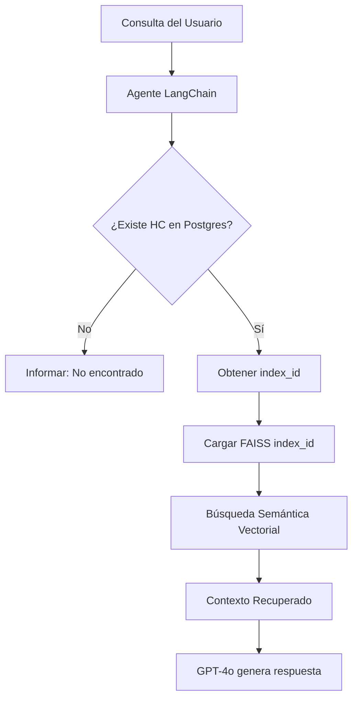

**Ventajas de esta implementación:**

* **Seguridad:** Los datos están compartimentados por paciente.
* **Escalabilidad:** El sistema puede manejar miles de documentos sin que la búsqueda vectorial se degrade, ya que solo se carga lo necesario.
* **Precisión:** Al filtrar por `hc_id`, el LLM recibe únicamente documentos relevantes a la historia clínica consultada.

---

### 8. Controles Identificados

* **Seguridad:** Uso de `.env` para la validación de claves de APIs `OPENAI_API_KEY` y Base de Datos `DB_URL`.
* **Acceso:** Restricción estricta de módulos según el rol (ej. `Cargar Historia` solo para administrador).
* **Integridad:** Transacciones atómicas en SQL y validación de rangos temporales en citas (Límites de 30 días).
* **Validación:** Verificación de existencia del `index_id` en PostgreSQL antes de buscar en FAISS.
* **Manejo de Errores:** Bloques `try-except-finally` en todas las interacciones con DB y RAG.

---

## 9. Casos de Pruebas Aplicando RAG

El pipeline está configurado y validado estructuralmente para resolver los siguientes escenarios del entorno de salud humana (basados en los documentos de la **Historia Clínica N° 81743**):

1. **Consulta de Datos Analíticos Cuantitativos:**
* *Pregunta:* *"¿Cuáles son los últimos exámenes de control metabólico registrados?"*
* *Comportamiento Validado:* El sistema extrae los bloques numéricos del PDF correspondientes a laboratorios (como Hemoglobina Glicosilada - HbA1c, Glucosa basal o perfiles lipídicos), filtrando de forma exacta la información sin alterar cifras ni fechas.

2. **Aislamiento de Observaciones Cualitativas Clínicas:**
* *Pregunta:* *"¿Cuál es la observación más relativa del informe endocrino?"*
* *Comportamiento Validado:* El extractor recupera el fragmento donde el médico especialista anotó sus conclusiones o variaciones de diagnóstico, ignorando la información administrativa del reporte.

3. **Recuperación de Planes e Instrucciones de Tratamiento:**
* *Pregunta:* *"¿Cuál es el último PLAN DE ALIMENTACIÓN INDIVIDUALIZADO PARA CONTROL DE DIABETES?"*
* *Comportamiento Validado:* El recuperador aisla la sección de la dieta personalizada guardada en el historial clínico de este paciente en particular, asegurando que el LLM devuelva las instrucciones dietéticas indicadas.

---

## 10. Captura de la Demo

La aplicación inicia con una autenticación segregada. En el módulo **"Cargar Historia"**, el administrador sube el PDF, que es procesado, convertido a vectores que se registran en FAISS y Postgres como referencia `index_id` para validar y agilizar la búsqueda.

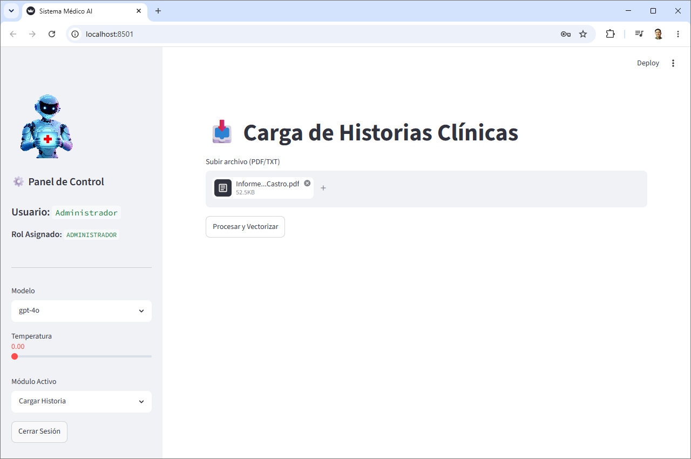

En los otros módulos, el **Agente RAG** utiliza la herramienta `herramienta_busqueda_rag` para consultar estos índices, devolviendo respuestas precisas que incluyen la fuente y el contexto clínico extraído, garantizando que el paciente o médico obtenga información veraz y trazable.

1. **Consulta de Datos Analíticos Cuantitativos:**
* *Pregunta:* *"¿Cuáles son los últimos exámenes de control metabólico registrados?"*
    
    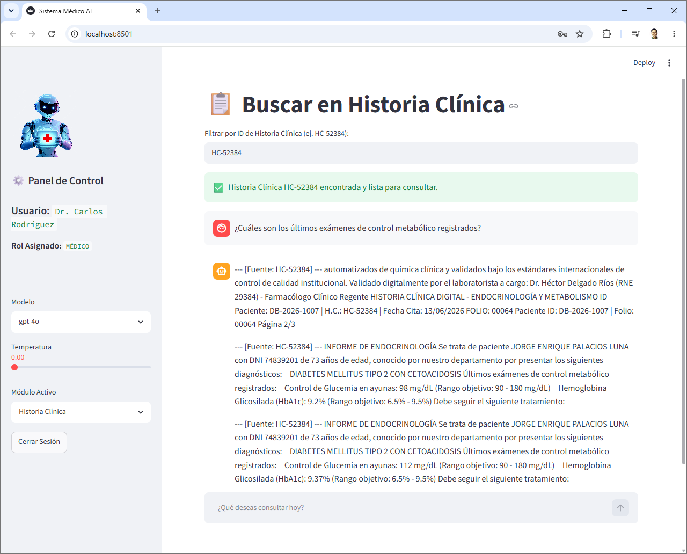

2. **Aislamiento de Observaciones Cualitativas Clínicas:**
* *Pregunta:* *"¿Cuál es la observación más relativa del informe endocrino?"*

    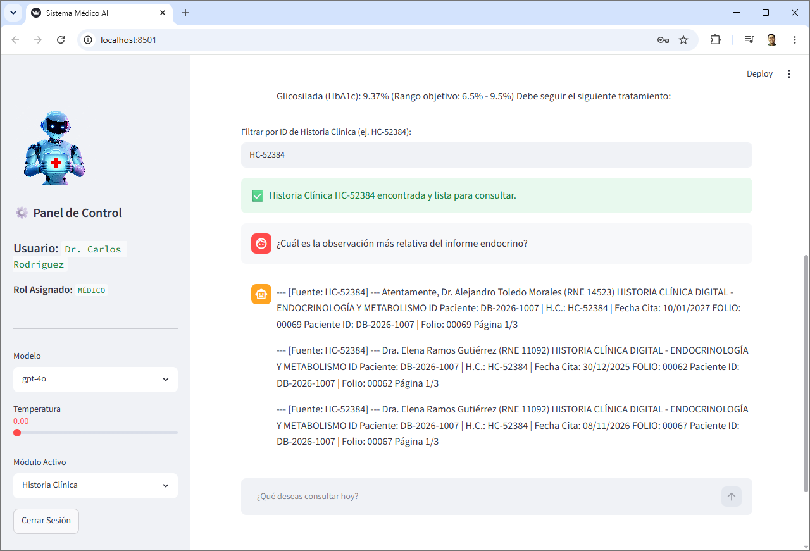

3. **Recuperación de Planes e Instrucciones de Tratamiento:**
* *Pregunta:* *"¿Cuál es el último PLAN DE ALIMENTACIÓN INDIVIDUALIZADO PARA CONTROL DE DIABETES?"*

    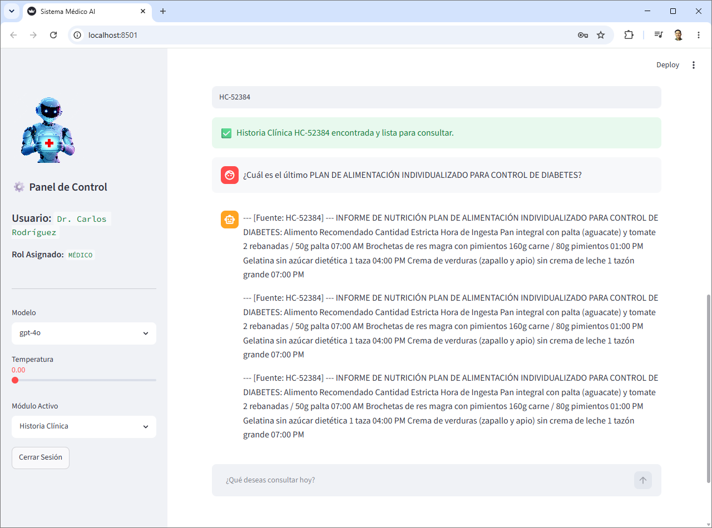

---

*Documentación elaborado por [Hadson Paredes](https://www.linkedin.com/in/hadson-paredes/) - 2026*
- Repositorio: [Project-Agentic-AI-SMAI](https://github.com/devhadson/Project-Agentic-AI-SMAI)
- Disponible como recurso públicos en [Hadson.Tech](https://hadson.tech/public-resources/project-agentic-ai/project-agentic-ai-smai)

<h4 align="center"> Publicaciones en mis redes sociales y repositorio GitHub</h4>

  <h3>Sígueme en mis redes sociales</h3>
  
  
  
  

